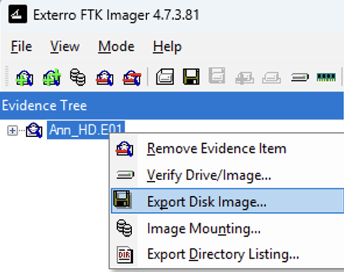

## Índice

- [1. Introducción](#introduccion) 
- [2. Bloque 1 - Análisis forense de un sistema informático](#bloque-1-analisis-forense-de-un-sistema-informatico) 
- [3. Bloque 2 – Informe Pericial](#bloque-2-informe-pericial) 
  - [3.1 Introducción](#bloque-2-introduccion) 
  - [3.2 Objeto y alcance](#bloque-2-objeto-y-alcance) 
  - [3.3 Metodología](#bloque-2-metodologia) 
  - [3.4 Resultados y evidencias](#bloque-2-resultados-y-evidencias) 
  - [3.5 Conclusiones periciales](#bloque-2-conclusiones-periciales) 
  - [3.6 Anexo](#bloque-2-anexo) 
- [4. Conclusión](#conclusion) 

---

<!-- Secciones: pega aquí el contenido correspondiente a cada apartado -->
<h2 id="introduccion">1. Introducción</h2>

La presente actividad se estructura en dos bloques cuyo objetivo es abordar de forma integral un supuesto caso de fraude con tarjetas bancarias en el que ha sido intervenido un equipo informático. En el primer bloque se llevará a cabo el análisis forense de la imagen digital, mientras que en el segundo se redactará un informe pericial ajustado a la norma UNE 197010 y a las mejores prácticas de la pericia forense. 

<h2 id="bloque-1-analisis-forense-de-un-sistema-informatico">2. Bloque 1 - Análisis forense de un sistema informático</h2>

El primer paso consiste en comprobar la integridad de la imagen recibida y así verificar que se ha respetado la cadena de custodia. Dado que la imagen está dividida en fragmentos de 655080 KB cada uno, crearemos con FTK Imager un único archivo que reúna todos esos ficheros. De este modo, podremos calcular los valores de resumen (hashes) correspondientes y compararlos con los proporcionados. 

    

<h2 id="bloque-2-informe-pericial">3. Bloque 2 – Informe Pericial</h2>

Resumen del Bloque 2... 

<h3 id="bloque-2-introduccion">3.1 Introducción</h3>

Contenido subsección 3.1... 

<h3 id="bloque-2-objeto-y-alcance">3.2 Objeto y alcance</h3>

Contenido subsección 3.2... 

<h3 id="bloque-2-metodologia">3.3 Metodología</h3>

Contenido subsección 3.3... 

<h3 id="bloque-2-resultados-y-evidencias">3.4 Resultados y evidencias</h3>

Contenido subsección 3.4... 

<h3 id="bloque-2-conclusiones-periciales">3.5 Conclusiones periciales</h3>

Contenido subsección 3.5... 

<h3 id="bloque-2-anexo">3.6 Anexo</h3>

Contenido subsección 3.6... 

<h2 id="conclusion">4. Conclusión</h2>

Contenido de la Conclusión... 
