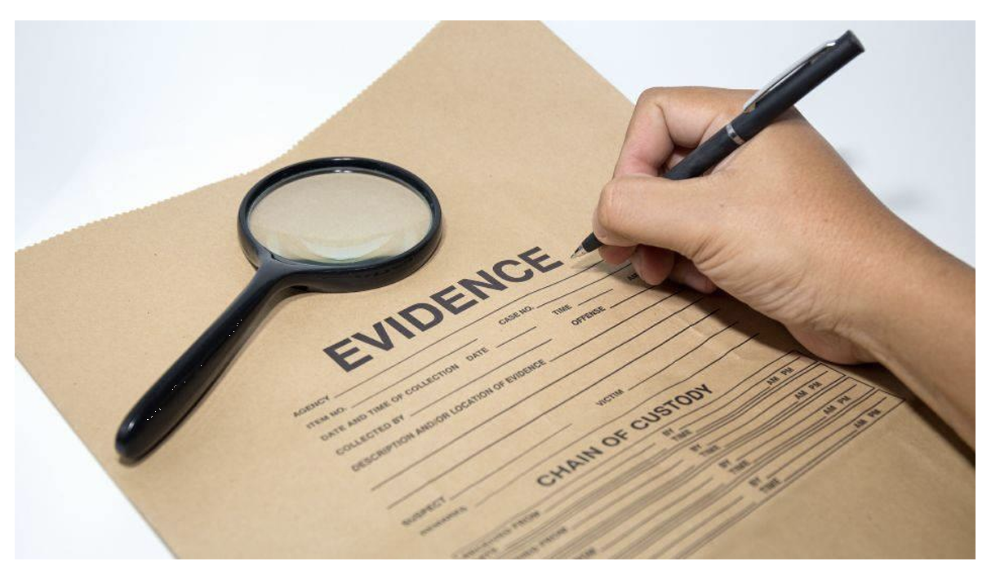
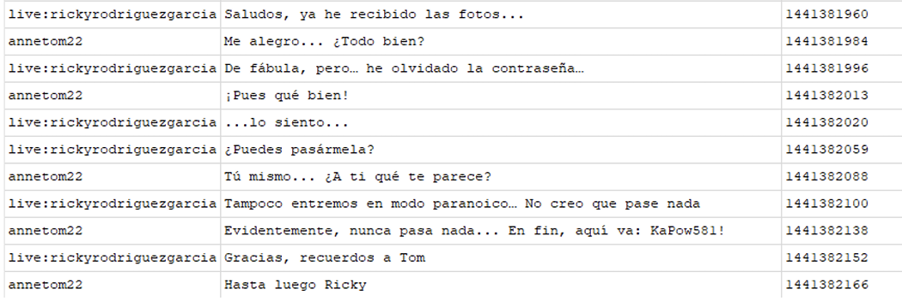
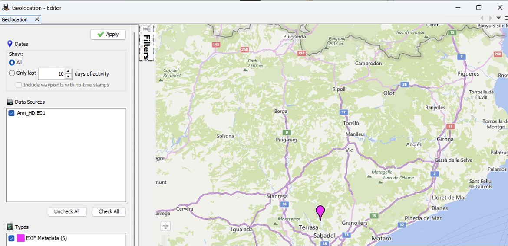

## Práctica de Análisis Forense: Investigación de Evidencia Digital e informe pericial

    

## Índice

- [1. Introducción](#introduccion) 
- [2. Bloque 1 - Análisis forense de un sistema informático](#bloque-1-analisis-forense-de-un-sistema-informatico) 
- [3. Bloque 2 – Informe Pericial](#bloque-2-informe-pericial) 
  - [3.1 Introducción](#bloque-2-introduccion) 
  - [3.2 Objeto y alcance](#bloque-2-objeto-y-alcance) 
  - [3.3 Metodología](#bloque-2-metodologia) 
  - [3.4 Resultados y evidencias](#bloque-2-resultados-y-evidencias) 
  - [3.5 Conclusiones periciales](#bloque-2-conclusiones-periciales) 
  - [3.6 Anexo](#bloque-2-anexo) 
- [4. Conclusión](#conclusion) 

---

<!-- Secciones: pega aquí el contenido correspondiente a cada apartado -->
<h2 id="introduccion">1. Introducción</h2>

La presente actividad se estructura en dos bloques cuyo objetivo es abordar de forma integral un supuesto caso de fraude con tarjetas bancarias en el que ha sido intervenido un equipo informático. En el primer bloque se llevará a cabo el análisis forense de la imagen digital, mientras que en el segundo se redactará un informe pericial ajustado a la norma UNE 197010 y a las mejores prácticas de la pericia forense. 

<h2 id="bloque-1-analisis-forense-de-un-sistema-informatico">2. Bloque 1 - Análisis forense de un sistema informático</h2>

El primer paso consiste en comprobar la integridad de la imagen recibida y así verificar que se ha respetado la cadena de custodia. Dado que la imagen está dividida en fragmentos de 655080 KB cada uno, crearemos con FTK Imager un único archivo que reúna todos esos ficheros. De este modo, podremos calcular los valores de resumen (hashes) correspondientes y compararlos con los proporcionados. 

    

Seleccionamos el formato de imagen resultante.

    

Nombre de la imagen y ruta de destino.

    

Calculamos los valores hash MD5 y SHA-1 para garantizar la integridad de la imagen recibida. Aunque 
el nombre del archivo resultante en FTK Imager no coincida exactamente con el de la imagen 
original, la herramienta fusiona de forma transparente todos los fragmentos en un único volumen 
RAW idéntico al inicial.

    

A continuación, mostramos el tamaño de la partición a analizar. En el volumen Ann_HD.E01, 
hacemos clic derecho sobre el archivo, seleccionamos Propiedades y comprobamos que su tamaño 
es de 10462593024 Bytes (aproximadamente 10,46 GB)

    

Para conocer el sistema y la versión del SO instalado navegamos hasta 
Windows\System32\config\SOFTWARE y extraemos la clave de Registro SOFTWARE que 
posteriormente analizaremos con la herramienta Register Explorer.

    

Mostramos las propiedades del fichero.

    

Analizando la clave de registro Software navegamos al directorio Microsoft\Windows 
NT\CurrentVersion y nos fijamos en los valores ProductName y CurrentVersion, demostrando que el 
Sistema operativo es Windows con la versión Windows 7 Professional 

    

En este mismo directorio podemos apreciar el nombre de usuario Ann y ninguna organización 
registrada. 

    

Además el ProductID asociado al sistema.

    

 
Debido a la ausencia de la clave CSDVersion, y a que tanto CurrentBuild como CurrentBuildNumber 
tienen valor 7600, podemos concluir que el sistema no tiene instalado ningún Service Pack. 

    

 
El campo InstallDate almacena la fecha y hora de instalación en formato timestamp Unix (segundos 
desde el 1 de enero de 1970, UTC); convertido a la hora local de Europa/Madrid, corresponde al 2 de 
septiembre de 2015 a las 12:17:43 CEST. 

    

 
Por otra parte, para determinar la fecha y hora del último apagado, extraemos la clave de registro 
SYSTEM, que presenta las siguientes propiedades.

    

 

    

 
Analizamos la clave con Register Explorer y en primer lugar revisamos el directorio SYSTEM\Select 
para identificar cuál ControlSet fue utilizado por el sistema en su último arranque exitoso apreciando 
que fue controlSet001, ya que el valor current es 1.

    

 
Navegamos al directorio ControlSet001\Control\Windows y apreciamos el valor ShutdownTime en 
Hexadecimal que convertido sabemos que la hora del último apagado fue 9 de abril de 2024 a las 
13:27:57 (hora local Europa/Madrid)

    

 
Para identificar los usuarios definidos en el sistema (excluyendo los creados por defecto) y 
determinar la fecha y hora de su último inicio de sesión, accedemos a la clave de registro SAM 
ubicada en el directorio Windows\System32\config, la extraemos y analizamos con Register 
Explorer. 

    

 
Mostramos las propiedades de este.

    

 
En el directorio Domains\Account\Users se identifican dos cuentas de usuario personalizadas: Tom y 
Anna, ambas con permisos de administrador. Analizando los datos de cada cuenta, se determina que: 
• El último inicio de sesión de Tom fue el 21 de octubre de 2015 a las 09:03:02. 
• El último inicio de sesión de Anna tuvo lugar el 21 de octubre de 2015 a las 13:54:18

    

 
A continuación, procedemos a localizar archivos eliminados en el sistema. Para ello, analizamos el 
contenido del directorio $Recycle.Bin, correspondiente a la Papelera de reciclaje de Windows. 
Dentro de este directorio identificamos una subcarpeta asociada al SID del usuario Ann 
$Recycle.Bin\S-1-5-21-2589184436-4231671082-1653910475-1000

    

 
El contenido del fichero corresponde a una lista de posibles datos sensibles organizada en bloques, 
cada uno compuesto por el tipo de tarjeta "Visa", un número de tarjeta de 16 dígitos que cumple con 
el formato típico de tarjetas Visa (comenzando por el dígito 4) y un nombre completo de persona. 
Identifico que el fichero es relevante para la causa investigada. 

    

 
Del mismo modo, localizamos el fichero $IQC0MZN.ods con la ruta al fichero 
C:\Users\Ann\Desktop\Pendientes.ods en su interior. 

    

 
Si lo extraemos y lo abrimos con LibreOfice podemos apreciar el siguiente contenido en su interior. 

    

 
Además de los ficheros previamente identificados, al examinar la galería de imágenes, 
específicamente en el directorio Users/Ann/Pictures/Fotos/Otras fotos, se localizó una fotografía 
denominada Playa.png con el siguiente contenido en su interior. 

    

 
Del mismo modo, analizando los metadatos de la imagen 20150907_162718.jpg incluye coordenadas 
GPS (latitud 41.611493 y longitud 2.081493) que sitúan la ubicación aproximada en Granollers 
Barcelona. 

    

 
En el mismo lugar también se sacaron las fotografías 20150907_162819.jpg y 20150907_162746.jpg 
todas vinculas al dispositivo móvil SAMSUNG SM-G350 

    

 
En el directorio Users/Ann/Downloads/se localizaron varios archivos comprimidos. 
• ListadoNumeraciones.zip

    

 
El cual estaba comprimido con contraseña. 

    

 
Para determinar si el archivo fue abierto recientemente, encontrar datos útiles en la caché y obtener 
posibles indicios sobre la contraseña utilizada, examino el directorio de archivos temporales del 
sistema, ubicado en /Users/Ann/AppData/Roaming/. Encuentro un el directorio dclogs, y dentro el 
fichero 2015-09-07-2.dc, el cual contiene parte de una conversación de Skype del usuario annetom22 
y la sentencia "Introducir contraseña: Kapo[<-][<-][<-][<-][<-]KaPoe[<-]w581!KaPow581! " y más 
abajo:: Documentos (19:41:09) 
[F2][<-]Listado n[<-][<-][<-][<-][<-][<-][<-][<-][<-]Listado numeracions[<-]es lo que me da a pensar 
que se trata de la contraseña para descomprimir el fichero.

    

 
Después de varios intentos, determino que la contraseña es KaPow581! y al descomprimir el .zip 
encontramos el ejecutable LlistatNumeracions.exe 

    

 
El cual analizándolo con VirusTotal nos reporta que es un fichero malicioso.

    

 
Al principio del fichero 2015-09-07-2.dc encontramos la sentencia "Enter password for 
C:\Users\Ann\MyHome (12:47:16) 
safePlace 
SafePlace 
" 

    

 
Navegamos al directorio y observamos que los resultados del análisis de MyHome muestran que este 
encriptado. 

    

 
Además, en las propiedades observamos que tiene un tamaño sospechoso. 

    

 
En el directorio Roaming, como vimos anteriormente, hemos encontrado una carpeta llamada 
TrueCrypt. TrueCrypt es una aplicación de cifrado de discos y contenedores de archivos que permite 
crear volúmenes cifrados para almacenar datos de forma segura; por tanto, es probable que 
MyHome sea en realidad un contenedor cifrado con TrueCrypt. 
Por lo tanto, en una máquina virtual nos descargamos la herramienta TrueCrypt, extraemos el 
contenedor de archivos MyHome y tratamos de montarlo en la máquina virtual.

    

 
Usamos la contraseña correcta "SafePlace" 

    

 
Comprobamos que se monta el volumen y podemos acceder a los ficheros de su interior. 

    

El contenido del fichero pwd.txt.txt vemos las credenciales de ambos usuarios del sistema operativo, 
una contraseña para la herramienta S-Tools, un programa de esteganografía para Windows que 
permite ocultar datos dentro de archivos, credenciales de Tom que posiblemente sean para descifrar 
el volumen MyHome, credenciales de correos tanto de Tom como Ann y credenciales de inicio de 
sesión a skype de Ann. 

    

Funciones de resumenes del fichero.

    

Propiedades del fichero. 

    

El contenido del fichero Tarjetas_Ricky.ods

    

Hashes de Tarjetas_Ricky.ods

    

Propiedades.

    

Contenido del fichero TOTAL.ods y hashes.

    

Propiedades.

    

Del mismo modo, indagando en el directorio Roaming encuentro una carpeta con nombre 
B7VDmwss, la cual tienen otro ejecutable que apunta a la referencia de un fichero localizado en 
/users/ann/downloads/thejerm.rar/thejerm.exe 

    

 
Y es otro programa malicioso.

    

 
Buscando información acerca de este último ejecutable encuentro que es un programa para codificar 
tarjetas de crédito. 

    

 
Debido a que he encontrado un trozo de una conversación en skype decido a indagar en el directorio 
Users/Ann/AppData/Roaming/Skype/annetom22 encontrando la base de datos main.db 

    

 
La extraigo y procedo a analizarla con la herramienta DB Browser for SQLite. Analizando la tabla 
Messages encontramos conversaciones de Ann con el usuario rickyrodriguezgarcia y aram768

    

 
Destacamos la siguiente conversación entre Ann y Ricky Rodríguez García donde vemos que este 
último le pide la contraseña KaPow581! para descomprimir el fichero ListadoNumeraciones.zip que 
al parecer le ha compartido. 

    

 
Puede ser relevante destacar la expresión “Recuerdos a Tom”, debido a la coincidencia en la 
existencia de un usuario llamado Tom. 
Cabe destacar la siguiente conversación, en la que el usuario live:aram768 contacta a Anne G.H. 
(annetom22) para concertar un encuentro y saldar el “último lote de tarjetas” pendiente; tras 
mencionar que ha descubierto un lugar “muy discreto” en la ciudad, envía tres fotos 
(20150907_162718.jpg, 20150907_162746.jpg y 20150907_162819.jpg), que Ann reconoce, y ambos 
acuerdan verse el próximo sábado a las 17:00.

    

 
Otra conversación es la siguiente, donde Ricky le envía a Ann un enlace por WeTransfer y al parecer 
Ann detecta algo raro en lo que descarga.

    

 
En la tabla Transfers vemos las imágenes que aram le envió a Ann y se almacenaron en el directorio 
C:\Users\Ann\AppData\Roaming\Skype\My Skype Received Files\ imágenes anteriormente 
analizadas y que fueron sacadas por Aram con el dispositivo Samsung. 

    

 
Analizando la tabla Contacts apreciamos el nombre completo de los usuarios. 

    

 
Continuamos buscando en el historial del explorador para así descubrir que fue lo que descargo Ann 
por Wetranfer. Accedemos al directorio 
Users/Ann/AppData/Roaming/Mozilla/Firefox/Profiles/xz1o6yiz.default/ y abrimos la base de 
datos places.sqlite donde se guardan principalmente el historial de búsqueda y marcadores de 
navegador Firefox. Encontramos que Ann descargo de Wetransfer el fichero ListadoNumeraciones.zip en cual analizamos anteriormente y verificamos que era un programa 
malicioso. 

    

 
Destacamos las siguientes búsquedas que realiza: 

    

 
Grabadora de tarjetas magnéticas MSR 206. 
https://www.google.es/search?q=msr+206&ie=utf-8&oe=utf-8&gws_rd=cr&ei=eGftVfzGNYO5UeeUhdAL 

    

 
La cual compra por Ebay.

    

 
Después busca tutoriales para aprender a utilizarla. 

    

 
Descarga la herramienta TheJerm la cual analizamos antes y comprobamos que sirve para codificar 
tarjetas de crédito, pero tenía malware en su interior. 

    

 

<h2 id="bloque-2-informe-pericial">3. Bloque 2 – Informe Pericial</h2>

<h3 id="bloque-2-introduccion">3.1 Introducción</h3>

En mi calidad de perito forense informático, a continuación, se presenta el Informe Pericial 
que recoge y ordena de forma estructurada los hallazgos obtenidos durante el análisis 
forense de la imagen digital cedida. 

• Perito: Borja García Dévora 

• Formación: Estudiante del Curso de Especialización en Ciberseguridad en Tecnologías 
de la Información, CIFP César Manrique 

• Fecha del informe: 26 de mayo de 2025 

• Declaración de veracidad: Declaro que los hechos y hallazgos descritos en este informe 
son veraces, completos y objetivos, sin introducir valoraciones personales que 
desvirtúen la evidencia recogida. 

<h3 id="bloque-2-objeto-y-alcance">3.2 Objeto y alcance</h3>

Objeto pericial: Determinar, mediante el análisis forense de la imagen E01 del disco duro 
aportado, la existencia, alcance y circunstancias de indicios de actividad delictiva relacionada 
con el fraude de tarjetas bancarias, identificando las herramientas maliciosas empleadas, las 
comunicaciones y descargas asociadas, los responsables y la información sustraída.

El Alcance del peritaje abarca: 

1. Verificación de la integridad de la imagen digital. 
2. Identificación y extracción de evidencias de sistema de ficheros, registro de Windows 
(SOFTWARE, SYSTEM, SAM), aplicaciones o directorios de usuario. 
3. Análisis de archivos eliminados recuperados. 
4. Examen de bases de datos SQLite de mensajería instantánea (Skype). 
5. Análisis de contenedores cifrados con TrueCrypt. 
6. Investigación de artefactos de software malicioso y datos sensibles (tarjetas, 
credenciales).  
7. Investigación del historial de navegación y descargas. 

<h3 id="bloque-2-metodologia">3.3 Metodología</h3>
Se han seguido las fases definidas en la norma UNE 197010:2015, adaptadas al entorno 
digital. 

El proceso comenzó con la adquisición y verificación de la imagen proporcionada Ann_HD.E01.

Se llevó a cabo el fusionado de los fragmentos obtenidos y la posterior creación de una 
imagen forense en formato RAW utilizando la herramienta FTK Imager. A continuación, se 
calcularon los valores hash MD5 y SHA-1 con el fin de garantizar la integridad de la evidencia 
digital y preservar la cadena de custodia. 

Preservación y custodia (Inventado según apuntes y norma UNE): 
Se realizó el etiquetado y registro detallado de cada fase del proceso en una bitácora, asegurando la trazabilidad de todas las acciones efectuadas. La evidencia fue almacenada en medios seguros con acceso restringido, garantizando su integridad y cumpliendo con los principios de la cadena de custodia. 

Análisis forense: 

Se utilizó Autopsy para la exploración del sistema de archivos, la recuperación de archivos eliminados y el análisis de metadatos, especialmente en imágenes. Mediante DB Browser for SQLite se accedió y consultó la base de datos main.db de Skype, extrayendo conversaciones y registros de transferencia de archivos. 

Asimismo, se empleó TrueCrypt para montar y acceder al contenedor cifrado MyHome, utilizando la contraseña hallada: "SafePlace". 
Como herramientas complementarias, se recurrió a Registry Explorer para el análisis del registro de Windows y a VirusTotal para verificar la presencia de código malicioso en archivos ejecutables sospechosos.

Herramientas y versiones: 

• Autopsy 4.19.3 
• FTK Imager 4.7.3.81 
• DB Browser for SQLite v3.12.2 
• Register Explorer 1.2.0.0 
• TrueCrypt 7.1a 
• Virus Total versión Web 
 

<h3 id="bloque-2-resultados-y-evidencias">3.4 Resultados y evidencias</h3>

Durante el análisis forense de la imagen digital se han identificado y documentado las 
siguientes evidencias, numeradas para su fácil referencia: 

Evidencia E-01: Registro de apagado y arranque 
A través del análisis de las claves del Registro SYSTEM y SOFTWARE con Autopsy y Register 
Explorer, se determinó que el último apagado del equipo ocurrió el 9 de abril de 2024 a las 
13:27:57 CEST. El sistema operativo corresponde a Windows 7 Professional sin Service Pack 
instalado. 

Evidencia E-02: Documento Pendientes.ods 
Recuperado de la papelera de reciclaje de la usuaria “Ann” mediante Autopsy, este archivo 
contiene listados parciales de posibles números de tarjetas Visa. El contenido muestra 
patrones consistentes con actividades de fraude bancario (por ejemplo, series de dieciséis 
dígitos con formatos válidos de tarjetas). 

Evidencia E-03: Fotografías con metadatos GPS 
En la carpeta Users/Ann/Pictures se localizó la imagen 20150907_162718.jpg. Sus 
metadatos inspeccionados en Autopsy, revelan coordenadas geográficas (41.611493 N, 
2.081493 E), correspondientes a Granollers. Vinculado con la conversación de Skype entre 
Ann y Aram, donde acuerdan un punto de reunión para realizar un pago de pedidos de 
tarjetas. 

Evidencia E-04: Archivo comprimido malicioso 
Mediante la exploración de descargas en Autopsy, se identificó ListadoNumeraciones.zip en 
Users/Ann/Downloads. Este ZIP contenía LlistatNumeracions.exe, detectado como malware 
por VirusTotal. La contraseña del ZIP, “KaPow581!”, se extrae del fichero 2015-09-07-2.dc 
localizado en el directorio Users/Ann/AppData/Roaming/dclogs/ y posteriormente se 
comprueba en los registros de conversación de Skype entre Ann y Ricky Rodríguez. 

Evidencia E-05: Contenedor cifrado MyHome 
En la ruta Roaming/TrueCrypt, se halló evidencias de la instalación en el sistema de esta 
herramienta y, por lo tanto, un posible volumen cifrado con TrueCrypt. El volumen se 
encontró en la ruta Users/Ann/MyHome. Al montarlo con la contraseña “SafePlace” 
(recuperada durante del fichero 2015-09-07-2.dc), se accedió a ficheros con credenciales de 
usuarios. 

Evidencia E-06: Base de datos de Skype (main.db) 
Con DB Browser for SQLite se abrió la base de datos de Skype 
/Users/Ann/AppData/Roaming/Skype/annetom22/main.db  . Se recuperaron 
conversaciones clave: 
Con Ricky Rodríguez García, intercambio de contraseñas y referencias a “recuerdos a Tom”. 
Así mismo el intento de Ricky de infectar el equipo de Ann promoviendo que descargara el 
software había compartido por WeTransfer. 
Con Aram768, cita para la entrega de tarjetas “el sábado a las 17:00” y envío de fotografías 
para ensenar la localización del lugar. 

Evidencia E-07: Historial de navegación de Firefox (places.sqlite) 
En el perfil de Firefox 
(Users/Ann/AppData/Roaming/Mozilla/Firefox/Profiles/xz1o6yiz.default/places.sqlite) se 
halló registro de la descarga de ListadoNumeraciones.zip desde WeTransfer, fichero que le 
había compartido Ricky. Además, se documentaron búsquedas de compra de la “msr 206” 
(grabadora de banda magnética), búsquedas para aprender a cómo utilizarla y la descarga de 
“TheJerm.rar”, dedicado a la codificación de bandas de tarjetas. 
Cada una de estas evidencias ha sido obtenida respetando la cadena de custodia y 
verificando la integridad mediante hashes criptográficos, garantizando así su fiabilidad en 
procedimiento judicial. 

<h3 id="bloque-2-conclusiones-periciales">3.5 Conclusiones periciales</h3>

1. Existencia de conducta fraudulenta: Se hallaron múltiples evidencias de 
manipulación y codificación de datos de tarjetas bancarias, inclusión de software 
malicioso destinado a lectura y escritura de bandas magnéticas (msr 206, TheJerm) y 
acuerdos privados entre usuarios para disposición del “último lote de tarjetas”.

2. Participación de los implicados: Las conversaciones de Skype y los archivos cifrados 
señalan a Ann (usuario del sistema) como nexo con terceros (Ricky, Aram) y posible 
intermediaria con Tom. 
3. Fiabilidad de la evidencia: Todos los artefactos se obtuvieron respetando la cadena 
de custodia y comprobando integridad mediante hashes. Las herramientas 
empleadas (Autopsy, DB Browser, TrueCrypt) son estándares en pericia forense 
digital. 

4. Limitaciones: 
a. No se dispone de evidencias volátiles, como la memoria RAM del equipo 
analizado ni de los dispositivos móviles de los implicados. 
b. Imposibilidad de utilizar las credenciales obtenidas de la plataforma Skype 
debido a su obsolescencia. 

<h3 id="bloque-2-anexo">3.6 Anexo</h3>

    

    

  
Capturas de pantalla relevantes: 
Conversación entre Ricky Rodríguez y Ann.

    

 
Conversación entre Ann y Aram donde se envían fotos para acordar un punto de reunión y 
entrega. 

    

 
Localización del punto de entrega. 

    

 
<h2 id="conclusion">4. Conclusión</h2>

En el presente trabajo se ha cumplido el objetivo de realizar un examen forense íntegro de la imagen 
digital aportada y de plasmar sus resultados en un Informe Pericial conforme a la norma UNE 
197010:2015 y a las buenas prácticas de la pericia informática.  
