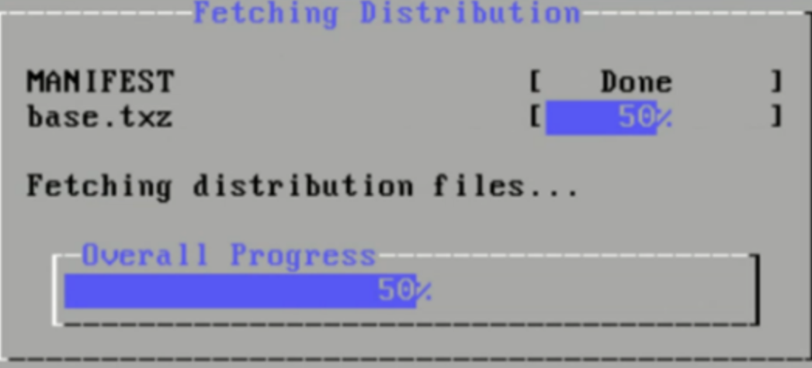
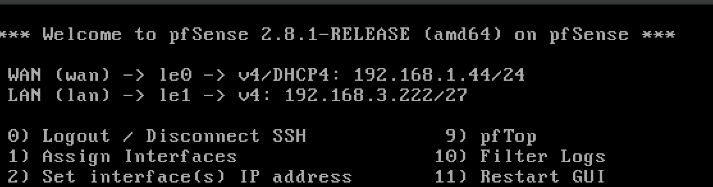

<h1 align="center">Diseño de una red corporativa - pfSense</h1>

## Índice

1. [Objetivo](#objetivo)  
2. [Introducción](#introducción)  
3. [Desarrollo](#desarrollo)  
   - [3.1. Crear máquina virtual en VirtualBox](#31-crear-máquina-virtual-en-virtualbox)  
   - [3.2. Instalación del firewall pfSense](#32-instalación-del-firewall-pfsense)  
   - [3.3. Crear las VLANs en el sistema pfSense y asignarlas a una tarjeta de red](#33-crear-las-vlans-en-el-sistema-pfsense-y-asignarlas-a-una-tarjeta-de-red)  
   - [3.4. Activamos el servicio de DHCP para las redes WiFi](#34-activamos-el-servicio-de-dhcp-para-las-redes-wifi)  
   - [3.5. Crear los Alias de las redes para trabajar con nombres](#35-crear-los-alias-de-las-redes-para-trabajar-con-nombres)  
   - [3.6. Reglas de firewall para bloquear tráfico entre redes](#36-reglas-de-firewall-para-bloquear-tráfico-entre-redes)  
   - [3.7. Abrimos los puertos de los servidores para acceso desde el exterior (NAT)](#37-abrimos-los-puertos-de-los-servidores-para-acceso-desde-el-exterior-nat)  
4. [Conclusión](#conclusión)

## Objetivo
El objetivo de esta práctica es implementar y documentar de manera detallada y estructurada los pasos necesarios para la instalación y configuración de pfSense, un firewall de código abierto. Este documento busca servir como guía técnica para garantizar una implementación exitosa, describiendo desde la creación de máquinas virtuales hasta la configuración de redes VLAN, asignación de direcciones IP, y definición de reglas de seguridad. 

## Introducción
pfSense es una solución de firewall y enrutamiento ampliamente utilizada en entornos de redes empresariales y educativas debido a su robustez, flexibilidad y disponibilidad gratuita. Este informe aborda el proceso completo de instalación y configuración de pfSense en un entorno virtualizado utilizando VirtualBox. Este documento incluye la configuración de adaptadores de red, creación de VLANs, definición de alias para facilitar la administración, y la aplicación de reglas de firewall, brindando un enfoque práctico para implementar una solución de seguridad eficaz en redes internas y externas. 

## Desarrollo

### 3.1. Crear máquina virtual en VirtualBox
En primer lugar, añadimos dos adaptadores de red en VirtualBox y los configuramos en modo Host‑Only, de modo que se crean interfaces virtuales que permiten la comunicación entre el anfitrión y la VM en redes privadas, lo que te permite simular un entorno realista con varias subredes y probar reglas de firewall, NAT o enrutamiento: 

  

En la máquina virtual, habilitamos tres adaptadores:
1. En modo puente, el cual nos proporcionará una ip con salida a internet.
2. En modo solo anfitrion(host only) y selecionando el adaptador 2 que creamos anteriormente con la IP 192.168.3.193/27, el cual nos servirá para crear las subinterfaces en pfSense.

3. En modo solo anfitrión asignandole el tercer adaptador que creamos y el cual simulará la conexión física a la máquina pfsense si fuera un entorno real(equivaldría a conectar un cable de red desde la tarjeta de red del firewall a un switch o a otro equipo).

  

### 3.2. Instalación del firewall pfSense
Seleccionamos la opción “Install pfSense”.

  

Dejamos el “keymap” y las opciones de particionado por defecto.
Procedemos a la instalación configurando ZFS como "stripe" ya que no hemos creados discos virtuales donde almacenar las copias.

  

Selecionamos el disco duro donde se va a realizar la instalación del sistema y esperamos a que finalice esta.

  

Una vez finalizada la instalación, asignaremos las direcciones IP a las interfaces seleccionando la opción 1 y pulsando Enter. Configuraremos el adaptador em0 con una dirección IP dinámica (DHCP) y el adaptador em1 con una dirección IP estática (dentro del rango), utilizando la siguiente configuración.

  

## Conclusión
Texto final.

