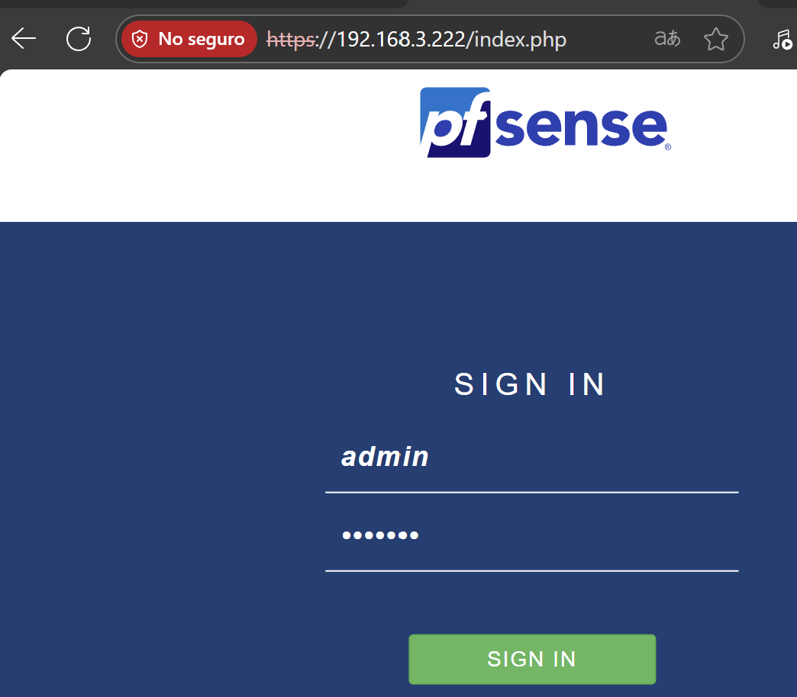
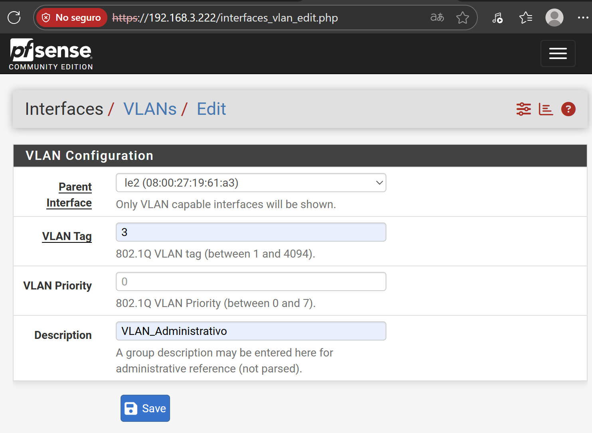

<h1 align="center">Diseño de una red corporativa - pfSense</h1>

## Índice

1. [Objetivo](#objetivo)  
2. [Introducción](#introducción)  
3. [Desarrollo](#desarrollo)  
   - [3.1 Crear máquina virtual en VirtualBox](#31-crear-máquina-virtual-en-virtualbox)  
   - [3.2 Instalación del firewall pfSense](#32-instalación-del-firewall-pfsense)  
   - [3.3 Crear las VLANs en el sistema pfSense y asignarlas a una tarjeta de red](#33-crear-las-vlans-en-el-sistema-pfsense-y-asignarlas-a-una-tarjeta-de-red)  
   - [3.4 Activar el servicio de DHCP para las redes WiFi](#34-activar-el-servicio-de-dhcp-para-las-redes-wifi)  
   - [3.5 Crear los Alias de las redes para trabajar con nombres](#35-crear-los-alias-de-las-redes-para-trabajar-con-nombres)  
   - [3.6 Crear las reglas de firewall para bloquear tráfico entre redes](#36-crear-las-reglas-de-firewall-para-bloquear-tráfico-entre-redes)  
   - [3.7 Abrir los puertos de los servidores para acceso desde el exterior (NAT)](#37-abrir-los-puertos-de-los-servidores-para-acceso-desde-el-exterior-nat)  
4. [Conclusión](#conclusión)

## Objetivo
El objetivo de esta práctica es implementar y documentar de manera detallada y estructurada los pasos necesarios para la instalación y configuración de pfSense, un firewall de código abierto. Este documento busca servir como guía técnica para garantizar una implementación exitosa, describiendo desde la creación de máquinas virtuales hasta la configuración de redes VLAN, asignación de direcciones IP, y definición de reglas de seguridad. 

## Introducción

***Este proyecto se ha desarrollado a partir de un esquema de subneteo previamente diseñado, con el fin de cumplir las especificaciones técnicas establecidas por la empresa***

pfSense es una solución de firewall y enrutamiento ampliamente utilizada en entornos de redes empresariales y educativas debido a su robustez, flexibilidad y disponibilidad gratuita. Este informe aborda el proceso completo de instalación y configuración de pfSense en un entorno virtualizado utilizando VirtualBox. Este documento incluye la configuración de adaptadores de red, creación de VLANs, definición de alias para facilitar la administración, y la aplicación de reglas de firewall, brindando un enfoque práctico para implementar una solución de seguridad eficaz en redes internas y externas. 

## Desarrollo

### 3.1. Crear máquina virtual en VirtualBox
En primer lugar, creamos un adaptador virtual con la herramienta de red de VirtualBox el cual nos servirá para conectarnos con la máquina virtual pfSense y nuestro host teniendo en cuenta el nuevo rango de red.

  

En la máquina virtual, habilitamos tres adaptadores:

Adaptador 1 → Modo puente (Bridged): proporciona una IP con salida a Internet (WAN).

Adaptador 2 → Modo solo anfitrión (Host-only): actúa como red de administración (LAN), permitiendo acceder a la interfaz web de pfSense desde el host o en un entorno real sería la  interfaz que se conectaría a un PC o red local para administrar el firewall.

Adaptador 3 → Modo puente (Bridged Adapter): simula la conexión física de pfSense hacia un switch real, y servirá como interfaz troncal (parent) para las VLANs creadas en pfSense.

  

### 3.2. Instalación del firewall pfSense
Seleccionamos la opción “Install pfSense”.

  

Dejamos el “keymap” y las opciones de particionado por defecto.
Procedemos a la instalación configurando ZFS como "stripe" ya que no hemos creados discos virtuales donde almacenar las copias.

  

Selecionamos el disco duro donde se va a realizar la instalación del sistema y esperamos a que finalice esta.

  

Una vez finalizada la instalación, asignaremos las direcciones IP a las interfaces seleccionando la opción 2 y pulsando Enter. Configuraremos el adaptador le0 con una dirección IP dinámica (DHCP) y el adaptador le1 con una dirección IP estática (dentro del rango), utilizando la siguiente configuración.

  

Accedemos al panel administrativo escribiendo en el navegador la IP asignada al segundo adaptador (192.168.3.222) e iniciamos sesión con las credenciales admin y pfsense.

  

### 3.3 Crear las VLANs en el sistema pfSense y asignarlas a una tarjeta de red

- Acceder al menú **Interfaces → Assignments → VLANs** para definir las VLANs que se van a crear.

  

Comenzamos creando la VLAN del departamento Comercial. Utilizamos le2 como la interfaz parent ya que  es la tarjeta de red física(Teoricamente) que estará conectada al switch en modo trunk. Solo esa interfaz puede enviar y recibir los paquetes con etiquetas VLAN (802.1Q).

  

Navegamos hasta el apartado **Interface Assigments** y añadimos la tarjeta de red le2 pulsando el boton verde Add, creando así la interfaz lógica en pfSense.
 

  

A continuación se verá de la siguiente manera.

  

De la misma forma, pfSense nos está avisando que también tenemos disponible un nuevo **network port** perteneciente a la VLAN 10 que creamos anteriormente para el departamento Comercial. La añadimos. Al darle a Add:

- pfSense tomará esa VLAN 10 y la añadirá a la lista de interfaces asignadas.
- Automáticamente se creará OPT2 (o el siguiente número disponible).
- A partir de ahí, podrás entrar en Interfaces > OPT2, habilitarla, darle un nombre (ej. “Comercial”), asignarle IP, máscara, DHCP, etc.
- Asignarla en Interface Assignments es lo que la convierte en una interfaz lógica que puedes administrar como si fuera una red independiente.

  

pfSense lo refleja así:
- OPT2 → es la interfaz lógica recién creada.
- VLAN 10 on le2 – opt1 (VLAN_Comercial) → te está diciendo:
  - Esta interfaz lógica (OPT2) corresponde a la VLAN 10.
  - El parent de esa VLAN es la tarjeta física le2.
  - El texto “opt1” aparece porque le2 ya estaba asignada como OPT1, y sobre ella se montó la VLAN.
  - “VLAN_Comercial” es la descripción que se puso al crear la VLAN.

  

**Realizaremos los mismos pasos por cada VLAN que tengamos.**

**Creación**

  

**Asignación**

  

### 3.4. Asignar el direccionamiento de red a cada VLAN
En este paso entraremos en la interfaz lógica de cada VLAN para asignarle la IP de gateway que se definió anteriormente en el plan de direccionamiento.

Comenzamos por la interfaz OPT2 ya que OPT1 no lleva IP porque es la interfaz física que conecta al switch y sirve de base para las VLANs.

  

Dentro de la configuración de la interfaz OPT2, la renombramos a Comercial, ya que pertenece a la VLAN_Comercial, la habilitamos y asignamos una IP estática dentro de su subred, la IP actua como gateway de la subred para los clientes.

  

Comprobamos que está habilitada en el panel principal del pfSense. Habilitar la interfaz significa darle vida a esa VLAN dentro de pfSense; pasa de ser solo un puerto lógico a convertirse en una red activa, con su propia IP, reglas y servicios. Sin habilitarla, pfSense no la usa ni la muestra en la mayoría de configuraciones.

  

Las interfaces quedarían de la siguiente forma.

  

### 3.4.1 Activar el servicio de DHCP para las redes WiFi

- Acceder a **Services → DHCP Server**.  
- Habilitar el DHCP para:  
  - **WiFi Corporativo**.  
  - **WiFi de Invitados**.

---

### 3.5 Crear los Alias de las redes para trabajar con nombres

- Ir a **Firewall → Aliases**.  
- Crear o editar los alias de las redes.  
- En la pestaña **Ports**, asignar alias a los puertos correspondientes.

---

### 3.6 Crear las reglas de firewall para bloquear tráfico entre redes

#### Reglas LAN

1. Regla anti-bloqueo (acceso a la interfaz web).  
2. Permitir acceso a servidores definidos por alias “Servidores”.  
3. Permitir tráfico IPv4 desde la LAN hacia cualquier destino.  
4. Permitir tráfico IPv6 desde la LAN hacia cualquier destino.

#### Reglas Administrativo

- Permitir acceso al NAS, FTP, servidor web, contabilidad y correo.  
- Permitir tráfico hacia el gateway.  
- Restringir acceso a otras VLANs.  
- Permitir tráfico no especificado.

#### Reglas Comercial

- Permitir acceso a NAS, FTP, web, contabilidad y correo.  
- Permitir tráfico hacia el gateway.  
- Bloquear acceso a otras VLANs.  
- Permitir tráfico no especificado.

#### Reglas Desarrollo

- Permitir tráfico hacia NAS, FTP, web, contabilidad y correo.  
- Permitir tráfico hacia su gateway.  
- Bloquear acceso a otras subredes internas.  
- Permitir tráfico restante.

#### Reglas DMZ

- Permitir tráfico hacia redes internas usando puertos de gestión.  
- Permitir tráfico desde LAN hacia redes internas en puertos de servicios.

#### Reglas VozIP

- Permitir tráfico hacia su gateway.  
- Bloquear tráfico hacia otras VLANs.

#### Reglas I+D

- Permitir tráfico hacia NAS, FTP, web, contabilidad y correo.  
- Permitir tráfico hacia su gateway.  
- Bloquear tráfico hacia otras subredes internas.  
- Permitir tráfico restante.

#### Reglas WiFi Corporativo

- Permitir tráfico hacia NAS, FTP, web, contabilidad y correo.  
- Permitir tráfico hacia su gateway.  
- Bloquear acceso a otras VLANs.  
- Permitir tráfico restante.

#### Reglas WiFi Invitados

- Permitir tráfico hacia su gateway y servidor web (HTTP y HTTPS).  
- Bloquear tráfico hacia otras VLANs.

---

### 3.7 Abrir los puertos de los servidores para acceso desde el exterior (NAT)

- Acceder a **Firewall → NAT**.  
- Abrir los puertos necesarios para cada servidor utilizando los alias creados previamente.

---

## Conclusión

La implementación de **pfSense**, siguiendo las instrucciones de este informe, permite disponer de un firewall robusto y personalizable para gestionar redes de forma segura.  
El proceso garantiza el control del tráfico entre redes, la segmentación mediante VLANs y la configuración de servicios como DHCP y NAT.  
Gracias a su flexibilidad y facilidad de uso, **pfSense** es una solución ideal para proteger y gestionar infraestructuras de red modernas, siendo una herramienta clave en el fortalecimiento de la seguridad informática.

